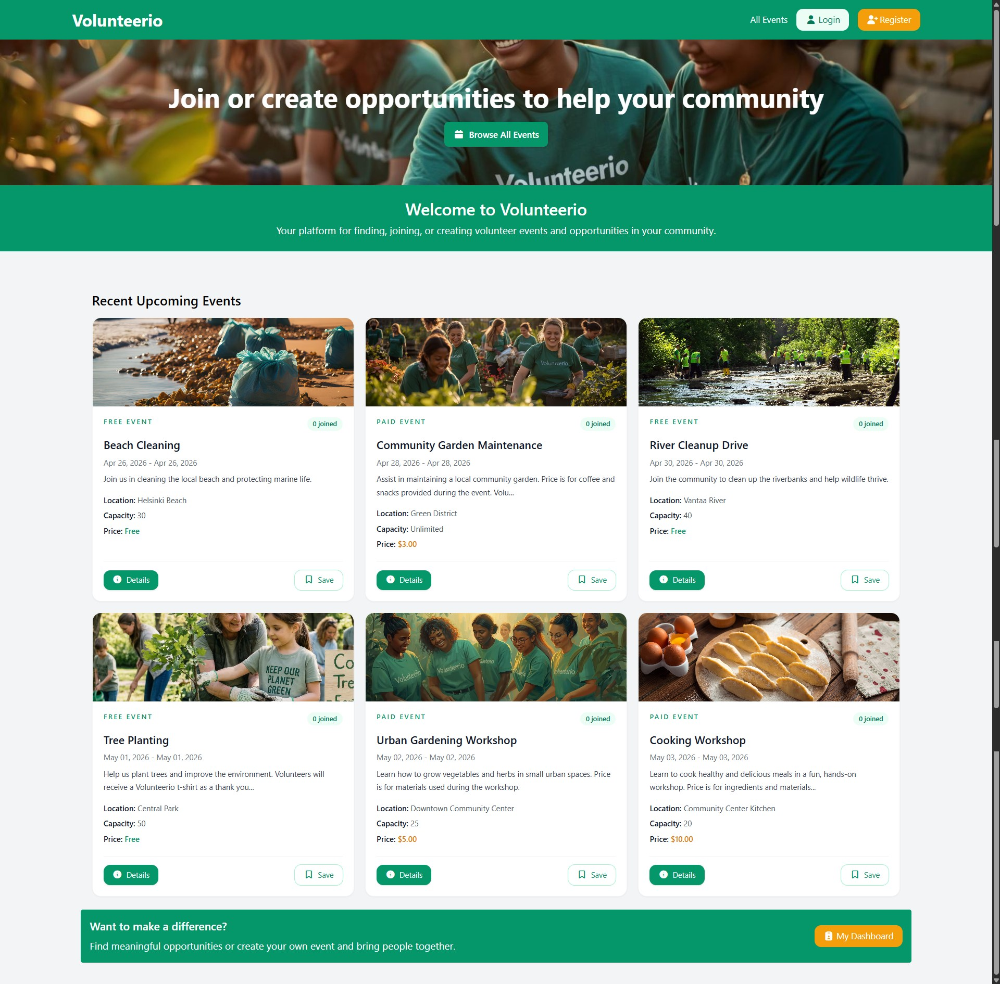
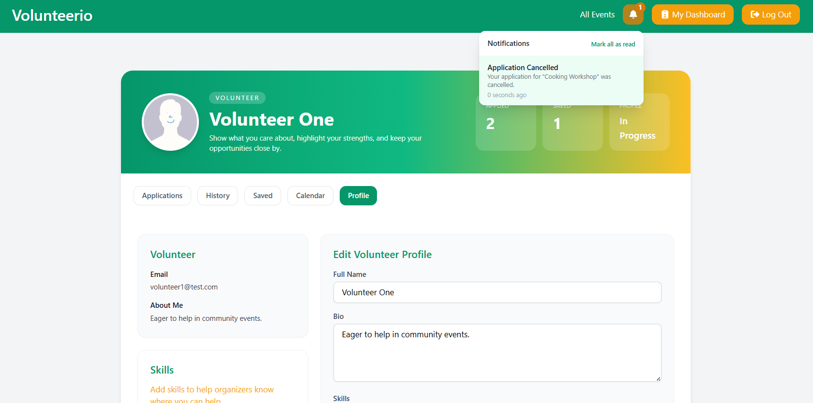

# Volunteer Event Platform (Laravel 13)


A full-stack Laravel application for managing volunteer events with role-based workflows and structured participation approval.

---

## 🌐 LIve Demo

This project runs locally. Follow the installation steps below to run it on your machine.

After setup, you can immediately explore the full workflow using pre-seeded accounts (see below).

---

## 🎯 Demo Accounts

Use these pre-seeded accounts to explore the system:

### 👤 Demo Organizer

Used to create and manage events, review applications, and assign volunteers.

- **Email:** testorganizer@test.com  
- **Password:** password 

---

### 🙋 Demo Volunteers

Used to browse events and submit applications

- **Email:** volunteer1@test.com  
- **Password:** password  

- **Email:** volunteer2@test.com  
- **Password:** password  

> These accounts are pre-seeded for demonstration purposes.

---

## 🧠 Project Overview

This application connects event organizers with volunteers through a structured workflow system.

It supports event creation, volunteer applications, approval processes, and role-based assignment including section-based participation.

Built using Laravel MVC architecture with a focus on clean workflow design and real-world event management logic.

---

## 💡 Motivation

This project was built to explore real-world workflow systems in Laravel, focusing on:

- Role-based access control  
- Multi-step approval workflows  
- Event management systems  
- Structured relationships between users, events, and participation roles

---

## 📸 Screenshots

### Landing page


### 🔐 Authentication


### 📅 Events


### 🙋 Volunteer Dashboard


### 🛠 Organizer Dashboard


### 🔔 Notifications


---

## 🚀 Features

### 👥 Authentication & Roles
- Organizer and Volunteer roles
- Role-based access control

### 📅 Event Management
- Create, update, delete events
- View event dashboard
- Manage participants

### 🙋 Volunteer System
- Browse and apply to events
- Track application status (pending / approved / rejected)
- View joined events

### 🧩 Event Workflow
- Application → approval → participation lifecycle
- Supports simple and section-based events

### ⏳ Waitlist System
- Automatically handles full events
- Volunteers can join waitlist when capacity is reached
- Organizers can promote users from waitlist to participants

---

## 🔔 Notifications

The application supports both email and in-app notifications for volunteers.

Notifications are triggered when:

- An application is approved
- An application is rejected
- An approved event is updated
- An approved event is cancelled
- An event reminder is sent before the event starts

In-app notifications are accessible via the bell icon in the top navigation.

Users can:

- Open a notification to navigate to the related page
- Mark individual notifications as read
- Mark all notifications as read

>The notification dropdown UI is implemented in
> resources/views/components/header.blade.php

---

## 🗄️ System Design

The system is built around a structured event participation workflow:

- Users can register as organizers or volunteers
- Organizers create and manage own events
- Volunteers apply for participation
- Applications are reviewed by organizers
- Approved volunteers are assigned to events or sections
- Participation is tracked throughout the system

### Core domain models:
- User (Organizer / Volunteer)
- Event
- EventApplication
- EventAttendee
- EventSection
- SectionVolunteer
- Message system
- EventApplicationStatusHistory

---

## 🧠 Architecture Decisions

### Separate Participation Models

The system distinguishes between:

- `EventAttendee` (simple events)
- `SectionVolunteer` (section-based events)

This separation avoids nullable fields and keeps relationships explicit,
making the workflow easier to reason about and extend.

### Application Status History

Application changes are tracked using `EventApplicationStatusHistory`
instead of a single status field.

This allows:

- auditing decisions
- tracking organizer actions
- enabling future analytics

### Notification Strategy

Notifications are handled using Laravel's notification system:

- Database notifications for in-app UI
- Mail notifications for external communication
- Scheduled reminders using Laravel scheduler

This design allows easy future extension (queues, real-time, etc.)

---

## ⚙️ Tech Stack

- Laravel 13
- Blade (UI)
- MySQL
- TailwindCSS

## 📁 Project Structure

The project follows Laravel MVC architecture:

```

app/
├── Http/
│   ├── Controllers/
│   ├── Middleware/
│   └── Requests/
├── Models/
│   ├── User.php
│   ├── Event.php
│   ├── EventApplication.php
│   ├── EventAttendee.php
│   ├── SectionVolunteer.php
│   ├── Message.php
│   ├── EventSection.php
│   ├── EventApplicationStatusHistory.php
resources/
├── views/
│   ├── events/
│   ├── dashboard/
│   ├── profile/
│   └── auth/
routes/
├── web.php
├── auth.php
database/
├── migrations/
├── seeders/

screenshots/

```
## 🌐 Key Routes (Overview)

| Route | Description |
|------|------------|
| `/events` | Browse events |
| `/events/{id}` | View event details |
| `/dashboard` | User dashboard |
| `/applications` | Manage applications |
| `/notifications` | View notifications |

> Routes are defined in `routes/web.php`
---

## 🔐 Roles

- Organizer → manages events and applications
- Volunteer → applies and participates in events

---

## 📝 Event Workflow

The system supports two event types:

### 🟢 Simple event
- Volunteer submits an application (EventApplication)
- Organizer reviews application (approve/reject)
- If approved → volunteer becomes EventAttendee

### 🟣 Sectioned event
- Volunteer submits an application (EventApplication)
- Volunteer selects a section when applying in message
- Organizer reviews application and assigns/validates section
- If approved → volunteer becomes SectionVolunteer

### 🔄 Summary

Volunteer → Apply → Organizer Review → Approve/Reject  
→ If approved → Assigned to Event / Section → Notification sent

---

## 🔮 Planned Features

- Admin dashboard for platform moderation  
- Multi-language support  
- Analytics dashboard for organizers  
- Editable static pages (About, Terms)  
- Ratings / reputation system  
- 1.Event scheduling with start/end time support 

---

## 📦 Installation

```bash
git clone https://github.com/HappyKarhu/volunteer-event-web.git
cd volunteer-event-web

composer install
npm install

cp .env.example .env
php artisan key:generate

php artisan migrate --seed

```
> ⚠️ Configure your `.env` file (database, mail, etc.) before running the project.

## ▶️ Running the project

This project requires both Laravel and Vite dev server:

- Backend: `php artisan serve`
- Frontend assets: `npm run dev`

Make sure both are running simultaneously.

---

## 🔔 Notification Setup

```bash

php artisan migrate

This will:

Create the notifications table
Add the reminder_sent_at column to events

```

### 📧 Local Email Testing

For local development, emails are written to the Laravel log.

In .env:

MAIL_MAILER=log

Check emails in:

storage/logs/laravel.log

### ⏰ Event Reminder Scheduler

Event reminders are handled by Laravel’s scheduler.

Run locally:

php artisan schedule:work

A reminder is sent when:
- Event status is published
- Event starts within the next 24 hours
- Event has approved participants
- `reminder_sent_at` is null

After sending, reminder_sent_at is updated to prevent duplicate reminders.

### 🌐 Testing Notifications in Browser

Start the app:
```bash
1. php artisan serve
2. Open:
http://127.0.0.1:8000
3. Log in as a volunteer and apply to an event
4. Log in as an organizer and approve/reject the application
5. Log back in as the volunteer
6. Click the bell icon to view the notification

```