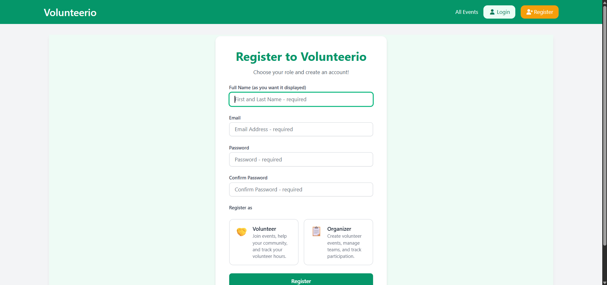
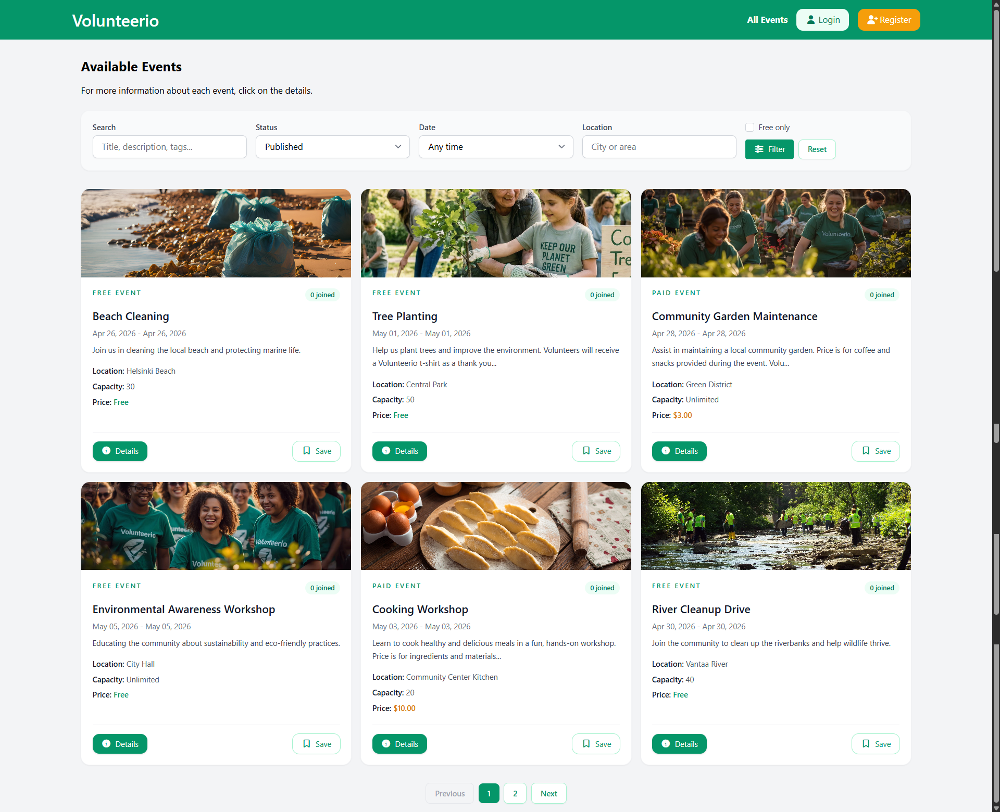
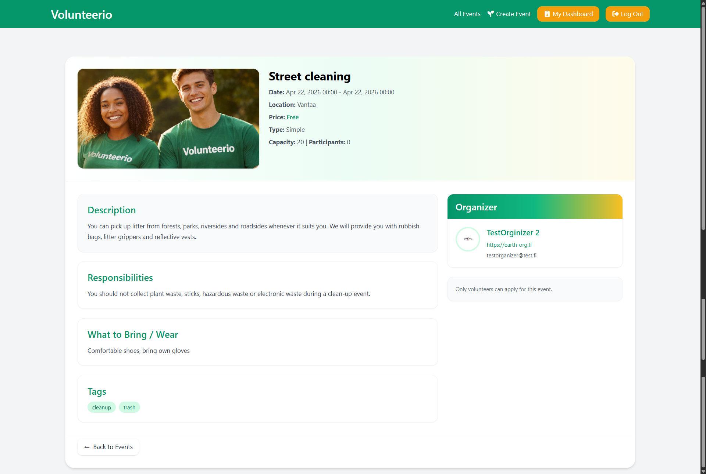
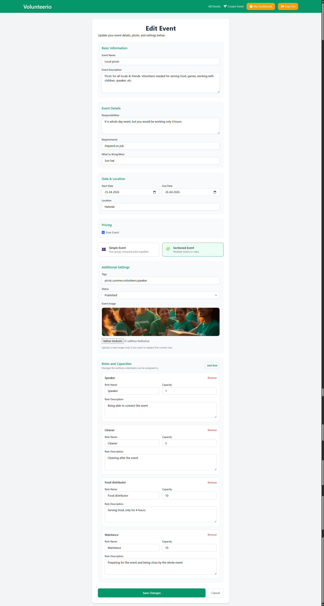
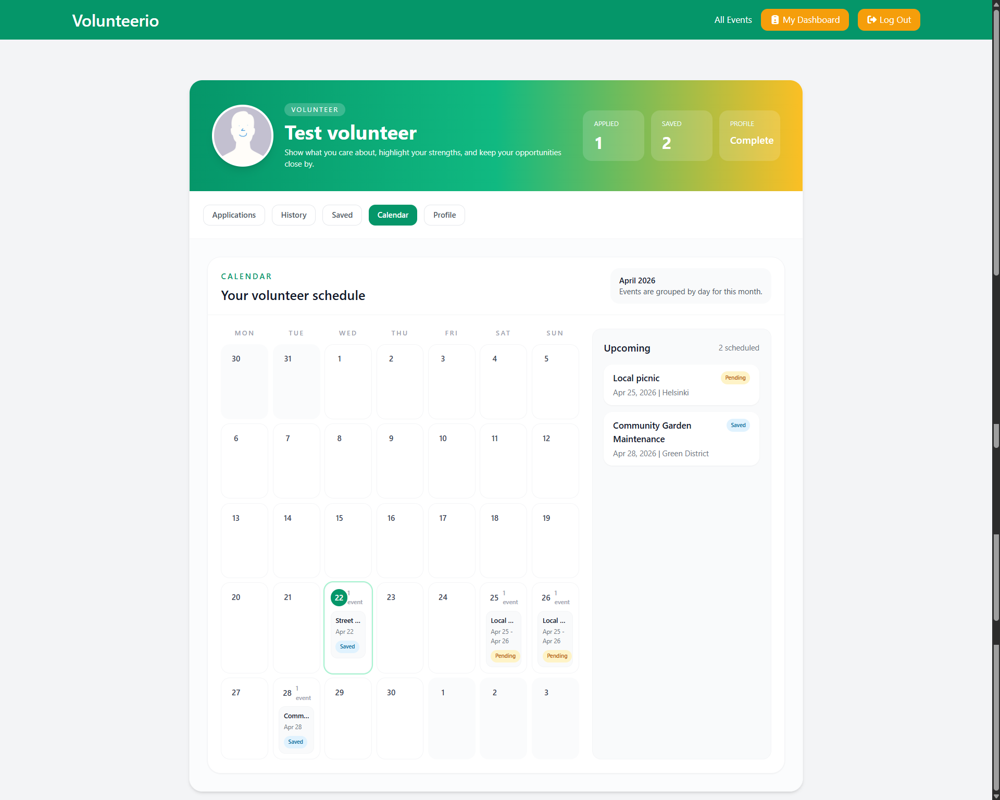
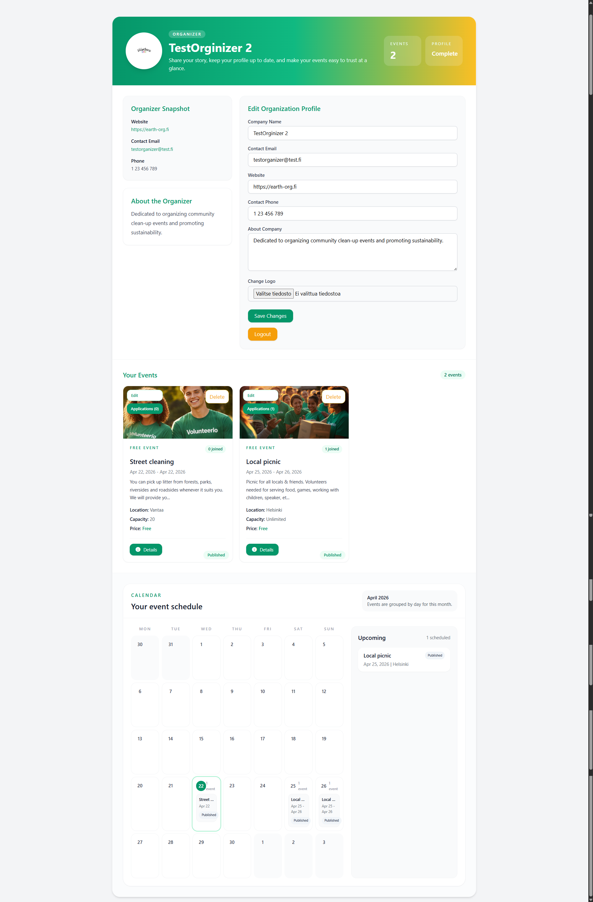

# Volunteer Event Platform (Laravel 13)
## 🌐 Demo

Currently runs locally. See installation instructions below.

A full-stack Laravel application for managing volunteer events with role-based workflows and structured participation approval.

## 🧠 Project Overview

A Laravel-based platform that connects event organizers with volunteers through a structured application and approval system.

Built using MVC architecture with role-based access control and workflow-driven event participation.

## 💡 Motivation

This project was built to explore workflow-driven systems in Laravel,
focusing on role-based access, event management, and approval pipelines.

## 📸 Screenshots
### Landing page


### 🔐 Authentication


### 📅 Events




### 🙋 Volunteer Dashboard


### 🛠 Organizer Dashboard


## 🚀 Features

### 👥 Authentication & Roles
- Organizer and Volunteer roles
- Role-based access control

### 📅 Event Management
- Create, update, delete events
- View event dashboard
- Manage participants

### 🙋 Volunteer System
- Browse and apply to events
- Track application status
- View joined events

### 🧩 Event Workflow
- Event application approval workflow
- Section-based volunteer assignment
- Application status tracking (approve / reject / pending)

## 🗄️ System Design

The system is built around a structured event participation workflow:

- Users can register as organizers or volunteers
- Organizers create and manage events
- Volunteers apply for participation
- Applications go through an approval workflow
- Accepted volunteers are assigned to events or sections

Core domain models:
- User
- Event
- Event Application
- Event Attendee
- Event Section
- Messaging System

## ⚙️ Tech Stack

- Laravel 13
- Blade (UI)
- MySQL
- TailwindCSS

## 📁 Project Structure

The project follows Laravel MVC architecture:

```

app/
├── Http/
│   ├── Controllers/
│   ├── Middleware/
│   └── Requests/
├── Models/
│   ├── User.php
│   ├── Event.php
│   ├── EventApplication.php
│   ├── EventAttendee.php
│   ├── SectionVolunteer.php
│   ├── Message.php
│   ├── EventSection.php
│   ├── EventApplicationStatusHistory.php
resources/
├── views/
│   ├── events/
│   ├── dashboard/
│   ├── profile/
│   └── auth/
routes/
├── web.php
├── auth.php
database/
├── migrations/
├── seeders/
screenshots/

```

## 🔐 Roles

- Organizer → manages events
- Volunteer → joins events

## 📝 Applying to the event

The system supports two event types:

### 🟢 Simple event
- Volunteer submits an application (EventApplication)
- Organizer reviews application (approve/reject)
- If approved → volunteer becomes EventAttendee

### 🟣 Sectioned event
- Volunteer submits an application (EventApplication)
- Volunteer selects a section when applying
- Organizer reviews application and assigns/validates section
- If approved → volunteer becomes SectionVolunteer

## 🔮 Planned Features

- Waitlist system
- Admin dashboard
- Multi-language support
- Analytics dashboard
- Editable pages (About, Terms, etc.)
- Ratings/reputation system

## 📦 Installation

```bash
git clone https://github.com/HappyKarhu/volunteer-event-web.git
cd volunteer-event-web
composer install
npm install
cp .env.example .env
php artisan key:generate
php artisan migrate --seed

```
> ⚠️ Configure your `.env` file (database, mail, etc.) before running the project.

## ▶️ Running the project

This project requires both Laravel and Vite dev server:

- Backend: `php artisan serve`
- Frontend assets: `npm run dev`

Make sure both are running simultaneously.