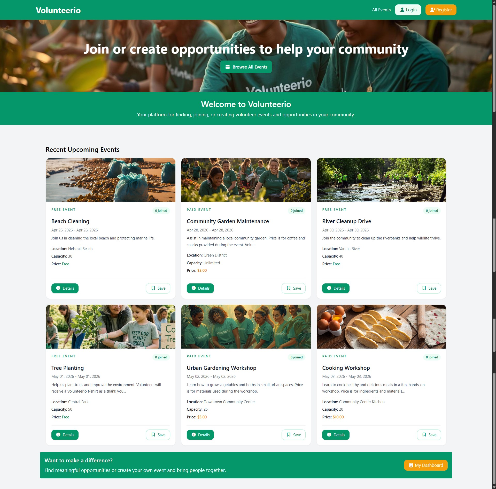
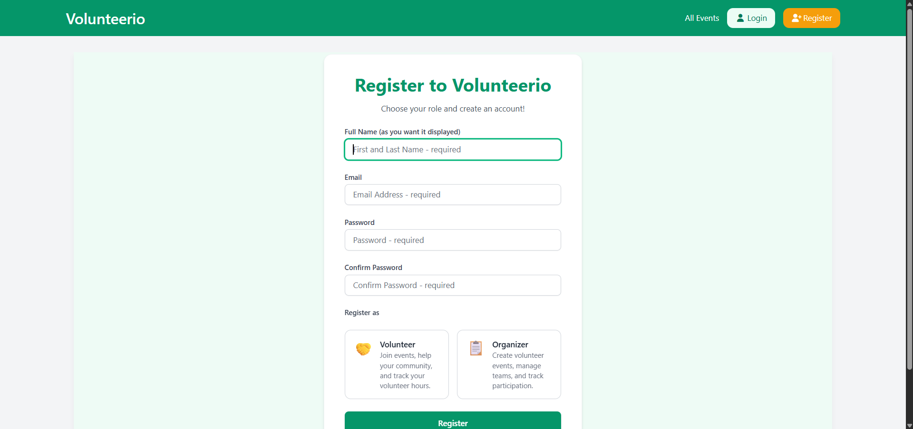
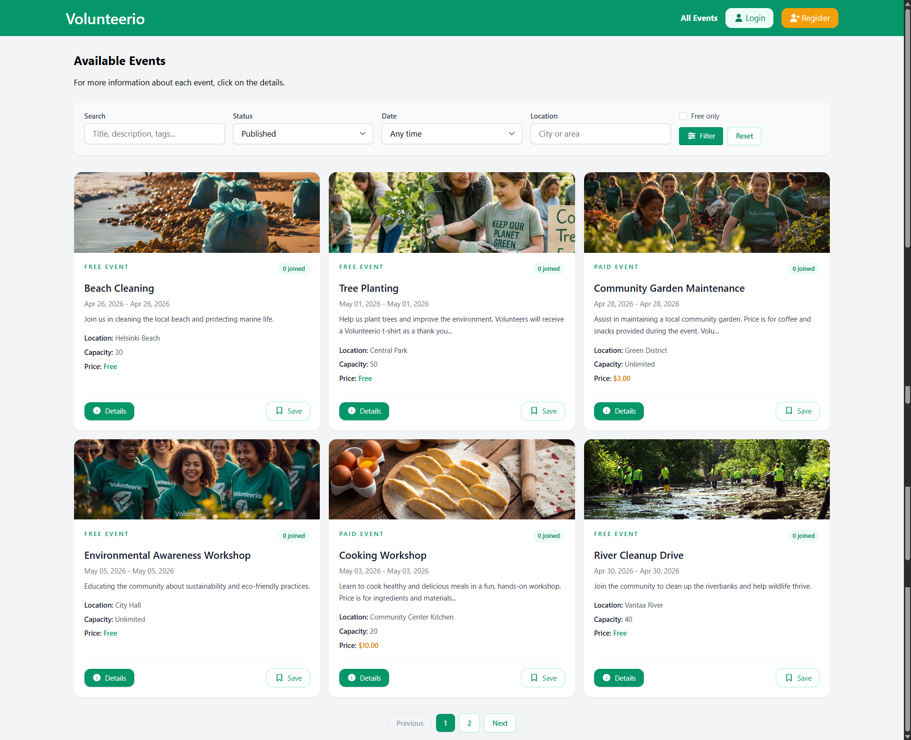
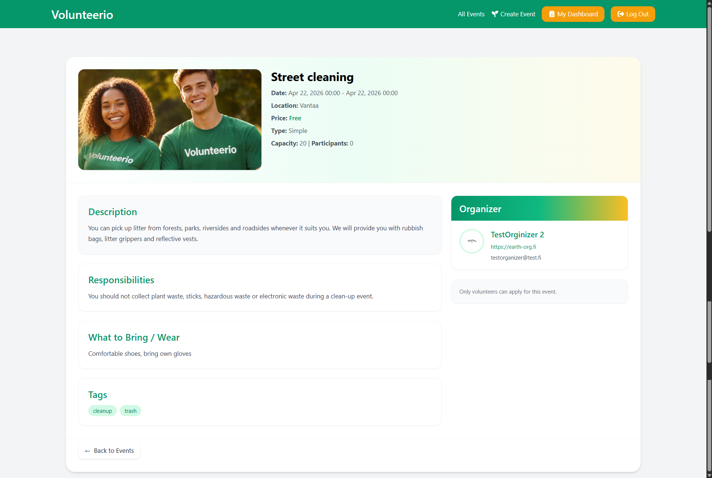
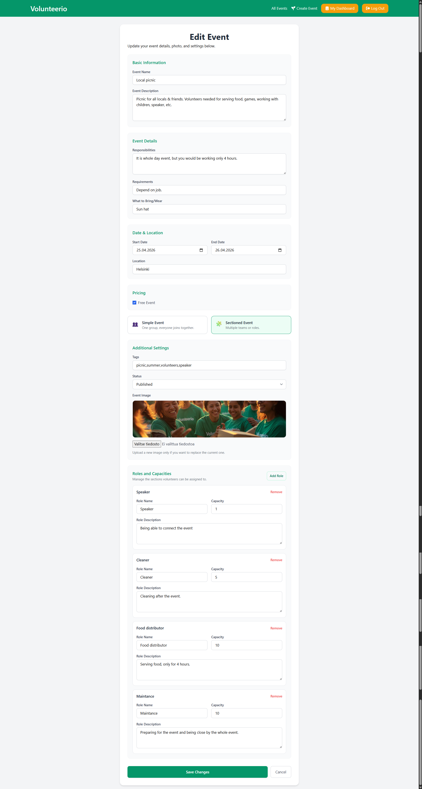
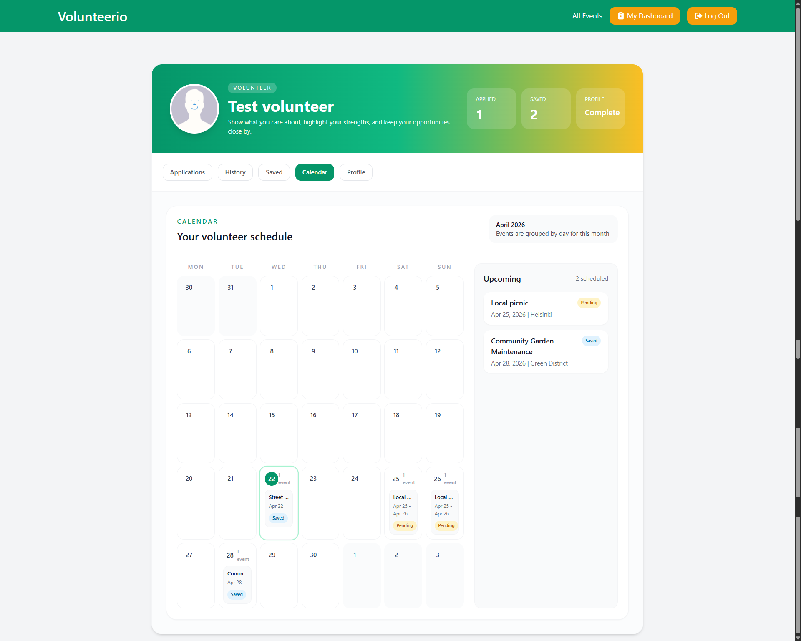
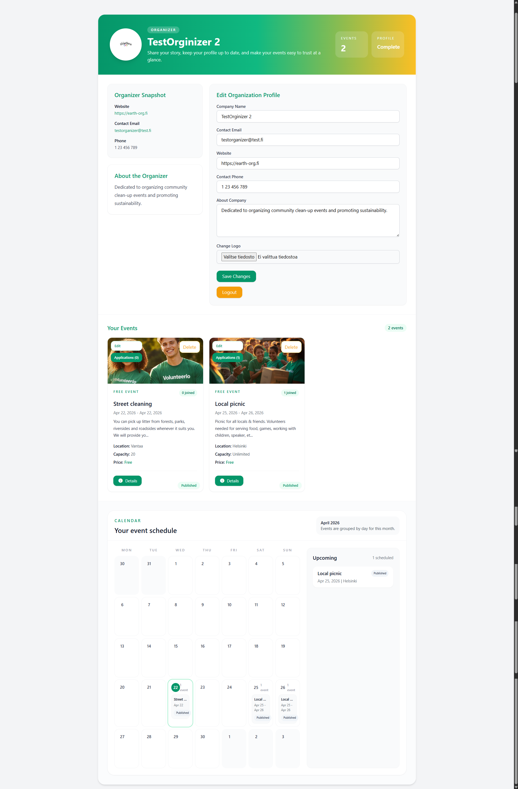
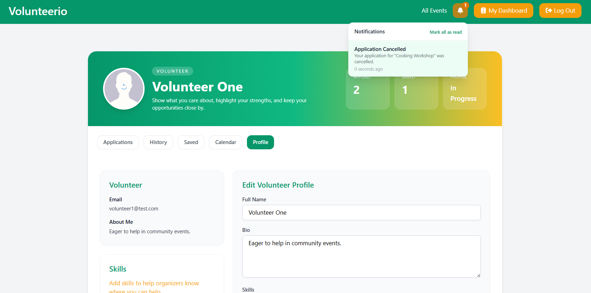

# Volunteer Event Platform (Laravel 13)


A full-stack Laravel application for managing volunteer events with role-based workflows, structured applications, approvals, waitlists, and notifications.

---

## Live Demo

This project runs locally. Follow the installation steps below to run it on your machine.

After setup, you can explore the full workflow using pre-seeded demo accounts.

---

## Demo Accounts

Use these pre-seeded accounts to explore the system.

### Demo Organizer

Used to create and manage events, review applications, and assign volunteers.

- **Email:** testorganizer@test.com
- **Password:** password

### Demo Volunteers

Used to browse events and submit applications.

- **Email:** volunteer1@test.com
- **Password:** password

- **Email:** volunteer2@test.com
- **Password:** password

> These accounts are pre-seeded for demonstration purposes.

---

## Project Overview

This application connects event organizers with volunteers through a structured workflow system.

Organizers can create events, review volunteer applications, approve or reject participation, manage attendees, and send notifications. Volunteers can browse events, apply, track application status, and receive updates.

The project is built using Laravel MVC architecture with a focus on real-world workflow logic, role-based access control, and testable application behavior.

---

## Motivation

This project was built to practice real-world Laravel application development, focusing on:

- Role-based access control
- Multi-step approval workflows
- Event and volunteer management
- Structured relationships between users, events, applications, attendees, and sections
- Automated testing for important user flows

---

## Screenshots

### Landing Page



### Authentication



### Events





### Volunteer Dashboard



### Organizer Dashboard



### Notifications



---

## Features

### Authentication and Roles

- Organizer and volunteer user roles
- Role-based route protection
- Organizer-only event management
- Volunteer-only application actions

### Event Management

- Create, update, and delete events
- Support for simple and section-based events
- Capacity handling for simple events
- Organizer dashboard for managing participation

### Volunteer Workflow

- Browse available events
- Submit event applications
- Track application status: pending, approved, rejected, cancelled, or waitlisted
- View joined events and application history

### Application Workflow

- Volunteer applies to an event
- Organizer reviews the application
- Organizer approves or rejects the application
- Approved volunteers become attendees or section volunteers
- Volunteers are notified when their application status changes

### Waitlist System

- Full events automatically place new applicants on the waitlist
- Waitlisted volunteers keep their application record
- The system supports promoting waitlisted volunteers when capacity becomes available

### Notifications

- Email and in-app notifications
- Application approval and rejection notifications
- Event update and cancellation notifications
- Event reminder notifications through Laravel scheduler

---

## System Design

The system is built around a structured event participation workflow:

- Users register as organizers or volunteers
- Organizers create and manage their own events
- Volunteers apply for participation
- Applications are reviewed by organizers
- Approved volunteers are assigned to simple events or event sections
- Participation and status changes are tracked in the database

### Core Domain Models

- `User`
- `Event`
- `EventApplication`
- `EventAttendee`
- `EventSection`
- `SectionVolunteer`
- `Message`
- `EventApplicationStatusHistory`

---

## Database Design

The main database relationships are centered around users, events, applications, attendees, sections, and notifications.

```text
User
  ├── Event
  ├── EventApplication
  └── Notification

Event
  ├── EventApplication
  ├── EventAttendee
  └── EventSection
```

Key relationship logic:

- Organizers create and manage `Event` records.
- Volunteers submit `EventApplication` records.
- Approved simple-event applications create `EventAttendee` records.
- Section-based events use `EventSection` and `SectionVolunteer`.
- Application status changes can trigger database and email notifications.

---

## Architecture Decisions

### Separate Participation Models

The system distinguishes between:

- `EventAttendee` for simple events
- `SectionVolunteer` for section-based events

This keeps relationships explicit and avoids overloading one table with nullable fields.

### Application Status History

Application status changes are tracked using `EventApplicationStatusHistory`.

This supports:

- Auditing organizer decisions
- Tracking application lifecycle changes
- Future analytics and reporting features

### Notification Strategy

Notifications use Laravel's notification system:

- Database notifications for the in-app notification UI
- Mail notifications for external communication
- Scheduled reminders using Laravel scheduler

This design can be extended with queues or real-time notifications in the future.

---

## Tech Stack

- Laravel 13
- PHP 8+
- Blade
- TailwindCSS
- MySQL
- Pest

---

## Project Structure

The project follows Laravel MVC architecture:

```text
app/
  Http/
    Controllers/
    Middleware/
    Requests/
  Models/
    User.php
    Event.php
    EventApplication.php
    EventAttendee.php
    SectionVolunteer.php
    Message.php
    EventSection.php
    EventApplicationStatusHistory.php

resources/
  views/
    events/
    dashboard/
    profile/
    auth/

routes/
  web.php
  auth.php

database/
  migrations/
  seeders/

screenshots/
```

---

## Key Routes

| Route | Description |
| --- | --- |
| `/events` | Browse events |
| `/events/{id}` | View event details |
| `/dashboard` | User dashboard |
| `/events/{event}/applications` | Organizer application management |
| `/events/{event}/apply` | Volunteer application submission |
| `/notifications` | In-app notification access |

Routes are defined in `routes/web.php`.

---

## Event Workflow

### Simple Event

- Volunteer submits an application
- Organizer reviews the application
- If approved, the volunteer becomes an `EventAttendee`
- If the event is full, the volunteer is added to the waitlist

### Sectioned Event

- Volunteer submits an application
- Organizer reviews the application
- Organizer assigns or validates a section
- If approved, the volunteer becomes a `SectionVolunteer`

### Workflow Summary

```text
Volunteer applies
Organizer reviews application
Application is approved or rejected
Approved volunteer is assigned to an event or section
Notification is sent
```

---

## Automated Testing

This project includes automated Feature and Unit tests using Pest and Laravel's testing tools.

Test coverage includes:

- User registration and authentication
- Profile update and account deletion flows
- Event application submission
- Application approval and rejection workflow
- Automatic attendee creation after approval
- Waitlist handling when event capacity is full
- Notification delivery using `Notification::fake()`
- Volunteer schedule conflict prevention
- Role-based authorization checks, including `403 Forbidden` protection for organizer-only event actions

Run the full test suite:

```bash
php artisan test
```

Current result:

```text
31 tests passed, 82 assertions
```

---

## Installation

```bash
git clone https://github.com/HappyKarhu/volunteer-event-web.git
cd volunteer-event-web

composer install
npm install

cp .env.example .env
php artisan key:generate

php artisan migrate --seed
```

Configure your `.env` file before running the project. At minimum, set your database and mail configuration.

---

## Running the Project

This project requires both the Laravel server and the Vite development server:

```bash
php artisan serve
npm run dev
```

Open the app in your browser:

```text
http://127.0.0.1:8000
```

---

## Notification Setup

For local development, emails can be written to the Laravel log.

In `.env`:

```env
MAIL_MAILER=log
```

Check emails in:

```text
storage/logs/laravel.log
```

### Event Reminder Scheduler

Event reminders are handled by Laravel's scheduler.

Run locally:

```bash
php artisan schedule:work
```

A reminder is sent when:

- Event status is published
- Event starts within the next 24 hours
- Event has approved participants
- `reminder_sent_at` is null

After sending, `reminder_sent_at` is updated to prevent duplicate reminders.

---

## Testing Notifications in Browser

To manually test notifications:

1. Start the app with `php artisan serve` and `npm run dev`.
2. Log in as a volunteer and apply to an event.
3. Log in as an organizer and approve or reject the application.
4. Log back in as the volunteer.
5. Click the bell icon to view the notification.

---

## Planned Features

- Admin dashboard for platform moderation
- Multi-language support
- Analytics dashboard for organizers
- Editable static pages such as About and Terms
- Ratings or reputation system
- More advanced event scheduling with start and end time support
